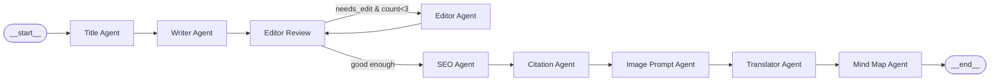

# 🤖 AI Content Factory

An end-to-end **multi-agent article generation pipeline** built with [LangGraph](https://github.com/langchain-ai/langgraph), [Ollama](https://ollama.com), and [Gradio](https://gradio.app). It generates a complete, SEO-optimized, bilingual (English → Persian) article from a single topic — including titles, draft, editorial review, SEO report, citations, image prompts, translation, and a mind map.

---

## ✨ Features

- **Multi-agent LangGraph pipeline** — 9 specialized agents orchestrated as a stateful graph with a conditional review loop.
- **Local LLM inference** via Ollama (Gemma 3 / Qwen 2.5) — no external API calls required for generation.
- **Bilingual output** — English article + Persian translation with RTL rendering and the Vazirmatn font.
- **Article-style awareness** — adapts tone, structure, and typography to `Academic`, `Educational`, `Technical Report`, or `Blog Post`.
- **Live streaming UI** — real-time markdown streaming into styled article containers (Inter font for English, Vazirmatn for Persian).
- **Pretty HTML reports** — SEO scores, citations, image prompts, and editor reviews rendered as polished cards (no raw JSON).
- **Review loop** — the reviewer can route back to the editor up to 3 times until quality is acceptable.
- **Persistent storage** — SQLite for articles + Redis for caching.
- **Mind map** — auto-generated hierarchical HTML mind map from the final article.

---

## 🏗️ Architecture



### Pipeline Nodes

| # | Node | Agent | Responsibility |
|---|------|-------|----------------|
| 1 | `title` | `title_agent` | Generates 5 SEO-optimized titles; respects a user-selected title if provided. |
| 2 | `writer` | `writer_agent` | Writes the full English article draft using style-specific prompts. |
| 3 | `editor_review` | `reviewer_state_agent` | Reviews the draft across 6 dimensions (grammar, clarity, structure, coherence, readability, SEO). |
| 4 | `editor` | `editor_agent` | Rewrites the article based on reviewer feedback (JSON-based). |
| 5 | `seo` | `seo_agent` | Optimizes the article for SEO; extracts keywords and a score. |
| 6 | `citation` | `citation_agent` | Extracts academic citations and builds a reference section. |
| 7 | `image` | `image_agent` | Generates 3 Stable Diffusion image prompts. |
| 8 | `translator` | `translator_agent` | Detects style, chunks the text, and translates to Persian in parallel. |
| 9 | `mind_map` | `mind_map_node` | Builds a hierarchical mind map (HTML/JS) from the English + Persian articles. |

### Review Loop

The `editor_review → editor → editor_review` loop runs **at most 3 times**. The router (`app/router.py`) sends the flow to `editor` when `needs_edit == True` and `review_count < 3`; otherwise it proceeds to `seo`.

---

## 📁 Project Structure

```
langchain/
│
├── app/                            # LangGraph orchestration
│   ├── graph.py                    # Builds & compiles the StateGraph
│   ├── state.py                    # ArticleState TypedDict (shared state schema)
│   └── router.py                   # Conditional edge: editor_review → editor | seo
│
├── agents/                         # One agent per pipeline node
│   ├── title_agent.py              # Generates titles (skips if user selected one)
│   ├── writer_agent.py             # Writes the English draft
│   ├── reviewer_agent.py           # Stateful reviewer (UI-facing)
│   ├── reviewer_agent_core.py      # Core reviewer LLM logic (JSON output)
│   ├── reviewer_state_agent.py     # LangGraph node wrapper for reviewer
│   ├── editor_agent.py             # JSON-based editor
│   ├── seo_agent.py                # SEO optimization
│   ├── citation_agent.py           # Citation extraction
│   ├── image_agent.py              # Image prompt generation
│   ├── translator_agent.py         # Style-aware Persian translator (parallel)
│   ├── mind_map_agent.py           # Mind map structure + HTML renderer
│   ├── knowledge_graph_agent.py    # (Aux) knowledge graph extraction
│   ├── node_content_agent.py       # (Aux) node content generation
│   └── node_expand_agent.py        # (Aux) node expansion
│
├── tools/                          # Shared utilities & prompts
│   ├── ollama_client.py            # Safe Ollama wrapper (retries, streaming)
│   ├── prompts.py                  # All LLM prompts (title/writer/editor/translator…)
│   ├── article_tools.py            # Title/writer/editor/translator tool functions
│   └── seo_tool.py                # SEO optimization helper
│
├── ui/                             # Gradio web UI
│   └── gradio_app.py               # Full app: streaming, styling, renderers, events
│
├── storage/                        # Persistence layer
│   ├── sqlite_db.py                # SQLAlchemy Article model
│   ├── repository.py               # save_article() → SQLite + Redis cache
│   └── redis_cache.py              # Redis get/set helpers
│
├── renderers/                      # (Reserved) graph & mindmap renderers
│   ├── graph_renderer.py
│   └── mindmap_html_renderer.py
│
├── collaboration/                 # (Reserved) WebSocket collaboration server
│   └── websocket_server.py
│
├── fonts/                          # Local web fonts
│   ├── Inter-Regular.ttf           # English body font
│   └── Vazirmatn-*.ttf             # Persian font (Regular → ExtraBold)
│
├── config.py                       # Model names & default temperature
├── run.py                          # Entry point → launches Gradio app
├── GraphVize.py                    # (Utility) quick graphviz test
├── .env                            # API keys (Tavily, OpenRouter)
└── articles.db / articles.sqbpro   # SQLite databases
```

---

## 🚀 Quick Start

### 1. Prerequisites

- **Python 3.10+**
- **[Ollama](https://ollama.com)** running locally on `http://localhost:11434`
- **[Redis](https://redis.io)** (optional, for caching) on `localhost:6379`

### 2. Pull the required models

```bash
ollama pull gemma3:270m      # title
ollama pull gemma3:12b       # writer
ollama pull gemma3:4b        # editor / reviewer
ollama pull qwen2.5:7b-instruct   # translator
```

> Model names are configured in [`config.py`](config.py).

### 3. Install Python dependencies

```bash
python -m venv .venv
.venv\Scripts\activate          # Windows
# source .venv/bin/activate     # Linux/macOS

pip install gradio langgraph ollama sqlalchemy redis python-dotenv
```

### 4. Run the app

```bash
python run.py
```

The Gradio UI opens at `http://127.0.0.1:7860`.

---

## 🎛️ Using the UI

1. **Enter a topic** (e.g. "Future of AI") and pick an **Article Type**.
2. Click **🔍 Generate Titles** → choose your favorite from the dropdown.
3. Either:
   - Click **✍️ Generate Draft** for a quick English article, or
   - Click **🚀 RUN FULL PIPELINE** to run the entire 9-node graph.

The pipeline streams the English draft and Persian translation in real time into styled article containers. Tabs show:

| Tab | Content |
|-----|---------|
| 📝 Article Draft | Live-streamed English article (Inter font, style-specific typography) |
| 🔍 SEO & Editor | Editor review card (scores + issues), SEO report card (score + keywords), edited article, suggested improvements |
| Persian Translation | RTL Persian article (Vazirmatn font) |
| 🗺️ Mind Map | Generated mind map visualization |
| 📦 Assets & Refs | Image prompt cards, citation list, full references |

---

## 🎨 Article Styles

The pipeline adapts both **LLM prompts** and **UI typography** to the selected article type:

| Style | Prompt Behavior | UI Typography |
|-------|----------------|--------------|
| **Academic** | IMRaD structure, formal tone, conceptual citations | Serif/Inter, justified, indented paragraphs |
| **Educational** | Step-by-step, definitions, callouts | Accent-colored headings, callout blockquotes |
| **Technical Report** | Problem→Analysis→Solution, metrics, tables | Orange accents, bordered headings |
| **Blog Post** | Conversational hook, short paragraphs, CTA | Large bold headings, purple blockquotes |

---

## 🔧 Configuration

### `config.py`

```python
OLLAMA_URL = "http://localhost:11434"

TITLE_MODEL = "gemma3:270m"
WRITER_MODEL = "gemma3:12b"
EDITOR_MODEL = "gemma3:4b"
TRANSLATE_MODEL = "qwen2.5:7b-instruct"

DEFAULT_TEMPERATURE = 0.7
```

### `.env`

```
TAVILY_API_KEY=...        # (optional) for web search tools
OPENROUTER_API_KEY=...   # (optional) for OpenRouter models
```

---

## 🧠 State Schema

The shared state is defined in [`app/state.py`](app/state.py) as a `TypedDict`:

```python
class ArticleState(TypedDict, total=False):
    topic: str
    temperature: float
    article_type: str
    title: Optional[str]
    titles: Optional[List[str]]
    selected_title: Optional[str]
    article: Optional[str]              # raw English
    edited_article: Optional[str]       # edited English
    reviewer_feedback: Optional[Dict]
    needs_edit: Optional[bool]
    review_count: Optional[int]
    seo_article: Optional[str]
    seo_score: Optional[int]
    seo_json: Optional[Dict]
    citations: Optional[List]
    reference_section: Optional[str]
    images: Optional[List[str]]
    persian_article: Optional[str]      # Persian translation
    detected_style: Optional[str]
    mindmap_html: Optional[str]
    mindmap_image: Optional[str]
    completed_steps: Optional[List[str]]
    # ... and more
```

Each node reads from the most authoritative field and falls back gracefully (e.g. `edited_article or article`).

---

## 🛡️ Error Handling

- **Ollama client** — 3 retries with exponential backoff.
- **Reviewer** — JSON parse failures return a fallback review dict.
- **Editor** — non-JSON output falls back to the original text.
- **SEO / Citations** — non-JSON LLM output is cleaned and gracefully degraded.
- **Translator** — per-chunk try/except; failed chunks become empty strings.

---

## 📦 Key Dependencies

| Package | Purpose |
|---------|---------|
| `langgraph` | Stateful multi-agent graph orchestration |
| `gradio` | Web UI with live streaming |
| `ollama` | Local LLM inference |
| `sqlalchemy` | SQLite persistence |
| `redis` | Article caching (optional) |

---

## 📝 Notes

- The `fonts/` folder is served at the `/fonts` route so `@font-face` can load Inter and Vazirmatn locally.
- The mind map is rendered as a self-contained HTML file (`mindmap.html`) using vanilla JS.
- The `renderers/` and `collaboration/` folders are reserved for future graph rendering and real-time collaboration features.

---

## 📄 License

This project is for educational and internal use.
